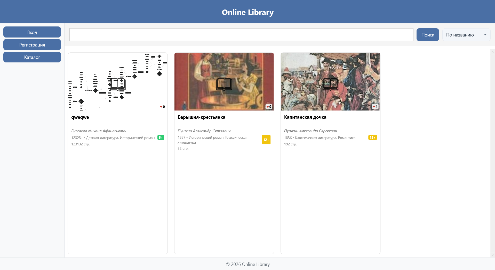
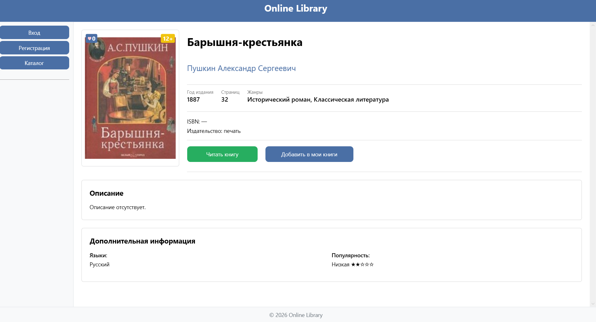
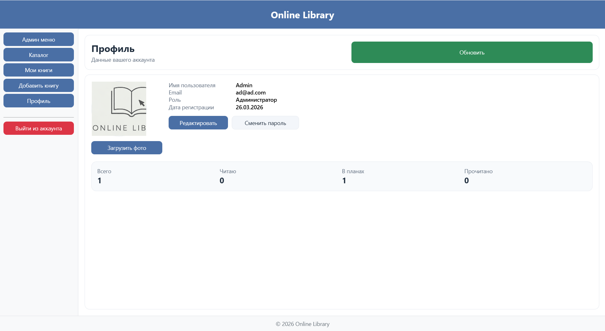

[README.md](https://github.com/user-attachments/files/28218146/README.md)
# Online Library

Курсовая работа на тему: **«Разработка информационной системы онлайн-библиотеки»**.

## Описание проекта

**Online Library** — это настольное приложение для работы с электронной библиотекой. Программа позволяет пользователям просматривать каталог книг, искать произведения по разным параметрам, открывать подробную информацию о книге, добавлять книги в личный список и читать текст книги внутри приложения.

Система предназначена для читателей и администратора библиотеки. Читатель может зарегистрироваться, войти в аккаунт, вести список своих книг и менять статус чтения. Администратор получает доступ к панели управления, где можно работать с пользователями и книгами.

Проект решает задачу автоматизации хранения и просмотра информации о книгах, авторах, жанрах, возрастных ограничениях, обложках и пользовательских списках чтения.

## Основные возможности

- регистрация и авторизация пользователей;
- разделение ролей: **Администратор** и **Читатель**;
- просмотр общего каталога книг;
- поиск книг по названию, автору, жанру, году издания и ISBN;
- фильтрация книг по жанру, году и возрастному ограничению;
- просмотр подробной информации о книге: название, автор, год, количество страниц, жанры, ISBN, издательство, языки, описание и популярность;
- добавление книги в раздел **«Мои книги»**;
- выбор статуса чтения: **«Читаю»**, **«В планах»**, **«Прочитано»**;
- чтение текста книги через встроенную страницу чтения;
- просмотр и редактирование профиля пользователя;
- смена пароля;
- добавление новых книг с указанием автора, жанров, языков, описания, обложки и файла книги;
- административная панель для управления пользователями и книгами.

## Технологии

- Язык программирования: **C#**
- Тип приложения: **WPF**
- Платформа: **.NET Framework 4.8**
- СУБД: **Microsoft SQL Server**
- Работа с БД: **System.Data.SqlClient**
- Конфигурация подключения: **App.config**
- Среда разработки: **Visual Studio**
- Система контроля версий: **Git / GitHub**

## Структура репозитория

Рекомендуемая структура проекта на GitHub:

```text
.
├── OnlineLibrary/
│   └── OnlineLibrary1/
│       ├── OnlineLibrary1.slnx
│       └── OnlineLibrary1/
│           ├── App.config
│           ├── App.xaml
│           ├── MainWindow.xaml
│           ├── Models/
│           └── Pages/
├── screenshots
│   ├──catalog.png
│   └──profile.png
├──  database.sql
├── screenshots/
│   ├── catalog.png
│   ├── book-details.png
│   └── my-books.png
├── docs/
│   └── course-work.pdf
└── README.md
```

## Как развернуть и запустить проект

### 1. Установить необходимое ПО

Перед запуском проекта нужно установить:

- **Visual Studio Community** с нагрузкой **«.NET desktop development»**;
- **.NET Framework 4.8**;
- **SQL Server Express** или другой установленный экземпляр Microsoft SQL Server;
- **SQL Server Management Studio (SSMS)** для запуска SQL-скрипта базы данных;
- **Git**, если проект будет скачиваться через команду `git clone`.

### 2. Скачать проект

Проект можно скачать двумя способами.

**Способ 1 — через GitHub:**

1. Открыть страницу репозитория.
2. Нажать кнопку **Code**.
3. Выбрать **Download ZIP**.
4. Распаковать архив в удобную папку.

**Способ 2 — через Git:**

```bash
git clone https://github.com/username/kursovaya-online-library.git
```

Вместо `username` нужно указать имя пользователя GitHub.

### 3. Развернуть базу данных

1. Открыть **SQL Server Management Studio**.
2. Подключиться к серверу, например:

```text
.\SQLEXPRESS
```

3. Нажать **New Query**.
4. Открыть файл:

```text
db/database.sql
```

5. Нажать **Execute**.
6. После выполнения скрипта должна появиться база данных:

```text
bibleoteka04
```

Если SSMS выдаёт ошибку при выполнении всего скрипта сразу, можно выполнить создание базы отдельно, а затем выполнить оставшуюся часть скрипта:

```sql
CREATE DATABASE bibleoteka04;
GO
USE bibleoteka04;
GO
```

### 4. Проверить строку подключения

В проекте открыть файл:

```text
OnlineLibrary1/OnlineLibrary1/App.config
```

Строка подключения должна соответствовать вашему SQL Server:

```xml
<connectionStrings>
  <add
    name="bibleoteka"
    connectionString="data source=.\SQLEXPRESS;Initial Catalog=bibleoteka04;Integrated Security=True"
    providerName="System.Data.SqlClient" />
</connectionStrings>
```

Если SQL Server установлен под другим именем, нужно заменить значение `data source`.

Примеры:

```text
.\SQLEXPRESS
(localdb)\MSSQLLocalDB
localhost
```

### 5. Открыть проект в Visual Studio

1. Открыть **Visual Studio**.
2. Нажать **Open a project or solution**.
3. Выбрать файл решения:

```text
src/OnlineLibrary1/OnlineLibrary1.slnx
```

Если файл решения не открывается, можно открыть файл проекта:

```text
src/OnlineLibrary1/OnlineLibrary1/OnlineLibrary1.csproj
```

4. Дождаться загрузки проекта и восстановления пакетов.
5. Нажать **F5** или кнопку **Пуск**.

## Данные для входа

После выполнения SQL-скрипта можно использовать тестовые аккаунты.

### Администратор

```text
Логин: admin@example.com
Пароль: adminpass123
```

### Читатель

```text
Логин: reader1@example.com
Пароль: readerpass456
```

Также можно зарегистрировать нового пользователя через форму **«Регистрация»**.

## Работа с программой

### Просмотр каталога

После запуска приложения открывается каталог книг. В каталоге можно просматривать список книг, использовать поиск и фильтры. Доступен поиск по названию, автору, жанру, году издания и ISBN.

### Регистрация и вход

Для работы с личными функциями нужно зарегистрироваться или войти в аккаунт:

1. Нажать **Регистрация**.
2. Ввести имя пользователя, email и пароль.
3. Подтвердить пароль.
4. Принять условия использования.
5. Нажать **Зарегистрироваться**.

После входа становятся доступны разделы **«Мои книги»**, **«Профиль»** и добавление книг.

### Добавление книги в личный список

1. Открыть каталог.
2. Выбрать нужную книгу.
3. Нажать **Добавить в мои книги**.
4. Выбрать статус чтения:
   - **Читаю**;
   - **В планах**;
   - **Прочитано**.
5. Нажать **Добавить**.

### Чтение книги

1. Открыть страницу выбранной книги.
2. Нажать **Читать книгу**.
3. Использовать кнопки перехода между страницами.
4. Для возврата нажать **Назад** или **В каталог**.

### Работа с профилем

В разделе **«Профиль»** отображаются:

- имя пользователя;
- email;
- роль;
- дата регистрации;
- статистика по книгам.

Пользователь может изменить данные профиля и сменить пароль.

### Добавление новой книги

1. Нажать **Добавить книгу**.
2. Заполнить основную информацию:
   - название;
   - автор;
   - год издания;
   - ISBN;
   - количество страниц;
   - возрастное ограничение.
3. Добавить жанры и языки.
4. Указать издательство и описание.
5. Загрузить обложку книги.
6. Загрузить файл книги или ввести текст вручную.
7. Нажать **Сохранить книгу**.

### Работа администратора

Администратор после входа видит кнопку **«Админ меню»**. В административной панели можно:

- просматривать список пользователей;
- искать пользователей;
- выдавать права администратора;
- снимать права администратора;
- удалять пользователей;
- просматривать список книг;
- искать книги;
- удалять книги из базы данных.

## Скриншоты

```markdown



```


## База данных

База данных называется **bibleoteka04**.

В базе используются следующие основные таблицы:

- `Users` — пользователи системы;
- `AuthUsers` — данные для авторизации;
- `Roles` — роли пользователей;
- `Book` — книги;
- `Author` — авторы;
- `Genre` — жанры;
- `GenreBook` — связь книг и жанров;
- `Age` — возрастные ограничения;
- `Favorites` — личный список книг пользователя;
- `Covers` — обложки книг;
- `Languages` — языки книг;
- `PublishingHouse` — издательства.

Пароли пользователей сохраняются в базе в виде хеша `SHA2_256`.

## Возможные проблемы и решения

### Ошибка подключения к базе данных

Проверьте строку подключения в `App.config`. Имя сервера должно совпадать с именем SQL Server на вашем компьютере.

### База данных не найдена

Проверьте, был ли выполнен файл `database.sql` и появилась ли база `bibleoteka04` в SSMS.

### Не открывается файл решения

Попробуйте открыть не файл `.slnx`, а файл проекта:

```text
OnlineLibrary1.csproj
```

### Не работает вход

Проверьте, что SQL-скрипт выполнился полностью и в таблицах `Users`, `AuthUsers`, `Roles` есть тестовые записи.

## Автор

**ФИО:** указать своё ФИО  
**Группа:** указать группу  
**Учебное заведение:** указать учебное заведение  
**Год:** 2026
